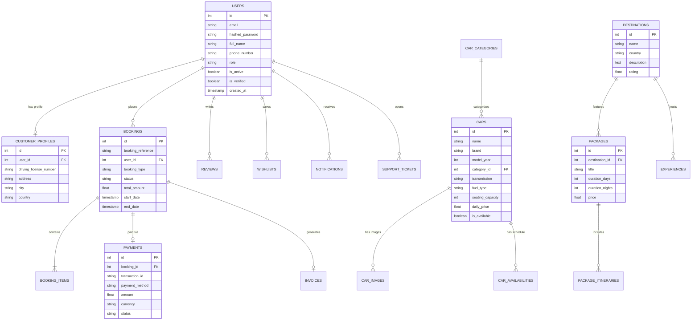

# TravelEase Entity-Relationship (ER) Diagram

Below is the database architecture diagram representing core entities, attributes, and their relationships.

```mermaid
erDiagram
    USERS ||--o| CUSTOMER_PROFILES : "has profile"
    USERS ||--o{ BOOKINGS : "places"
    USERS ||--o{ REVIEWS : "writes"
    USERS ||--o{ WISHLISTS : "saves"
    USERS ||--o{ NOTIFICATIONS : "receives"
    USERS ||--o{ SUPPORT_TICKETS : "opens"

    CAR_CATEGORIES ||--o{ CARS : "categorizes"
    CARS ||--o{ CAR_IMAGES : "has images"
    CARS ||--o{ CAR_AVAILABILITIES : "has schedule"

    DESTINATIONS ||--o{ PACKAGES : "features"
    DESTINATIONS ||--o{ EXPERIENCES : "hosts"
    PACKAGES ||--o{ PACKAGE_ITINERARIES : "includes"

    BOOKINGS ||--|{ BOOKING_ITEMS : "contains"
    BOOKINGS ||--o| PAYMENTS : "paid via"
    BOOKINGS ||--o| INVOICES : "generates"

    USERS {
        int id PK
        string email
        string hashed_password
        string full_name
        string phone_number
        string role
        boolean is_active
        boolean is_verified
        timestamp created_at
    }

    CUSTOMER_PROFILES {
        int id PK
        int user_id FK
        string driving_license_number
        string address
        string city
        string country
    }

    CARS {
        int id PK
        string name
        string brand
        int model_year
        int category_id FK
        string transmission
        string fuel_type
        int seating_capacity
        float daily_price
        boolean is_available
    }

    DESTINATIONS {
        int id PK
        string name
        string country
        text description
        float rating
    }

    PACKAGES {
        int id PK
        int destination_id FK
        string title
        int duration_days
        int duration_nights
        float price
    }

    BOOKINGS {
        int id PK
        string booking_reference
        int user_id FK
        string booking_type
        string status
        float total_amount
        timestamp start_date
        timestamp end_date
    }

    PAYMENTS {
        int id PK
        int booking_id FK
        string transaction_id
        string payment_method
        float amount
        string currency
        string status
    }
```
