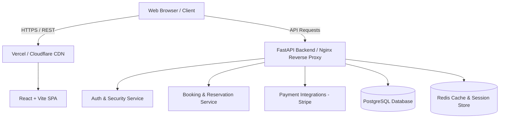

# System Architecture

TravelEase is designed as a scalable multi-tier distributed web application consisting of a React Single Page Application (SPA), a high-performance FastAPI backend service, and a PostgreSQL database.

## High-Level Architecture

